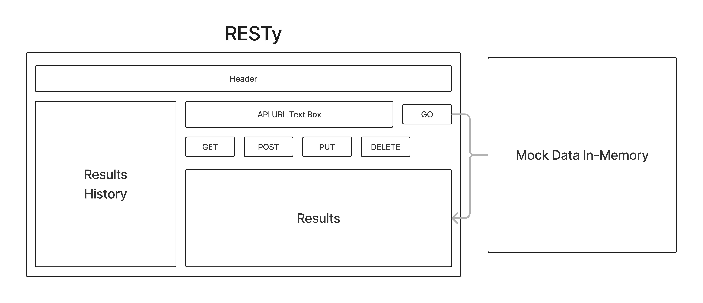

# RESTy

A browser based API testing tool

## Business Requirements

Our application will be an API testing tool that can be run in any browser, allowing a user to easily interact with APIs in a familiar interface.

## Repository Branches

- Lab 26 Branch -

## Deployed links

- Lab 26 Codesandbox -

## UML Diagrams

- Lab 26 - 
