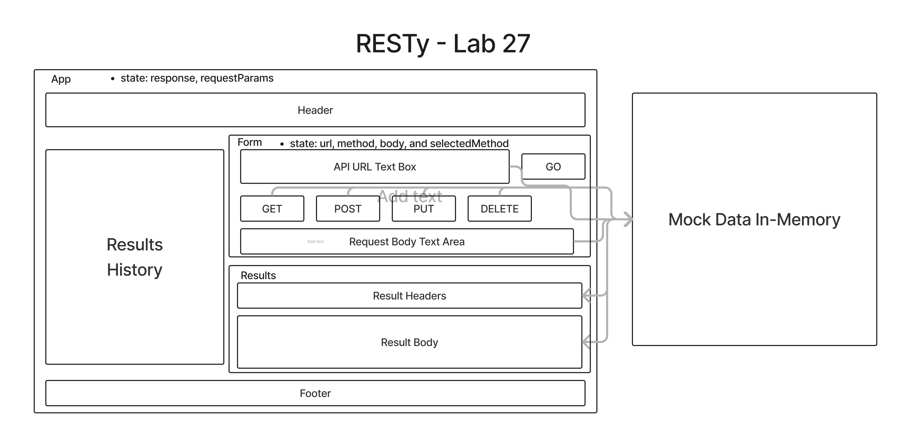

# RESTy

A browser based API testing tool

## Business Requirements

This application is an API testing tool that can be run in any browser, allowing a user to easily interact with APIs in a familiar interface.

## Repository Branches

- Lab 26 Branch - [GitHub Lab 26 branch](https://github.com/brandenge/resty/tree/lab-26)
- Lab 27 Branch - [GitHub Lab 27 branch](https://github.com/brandenge/resty/tree/lab-27)

## Deployed links

- Lab 26 Codesandbox - [Codesandbox Lab 26](https://codesandbox.io/p/github/brandenge/resty/draft/tender-sound?file=%2FREADME.md)
- Lab 26 Codesandbox - [Codesandbox Lab 27]()

## UML Diagrams

- Lab 26 - 
- Lab 27 - 
